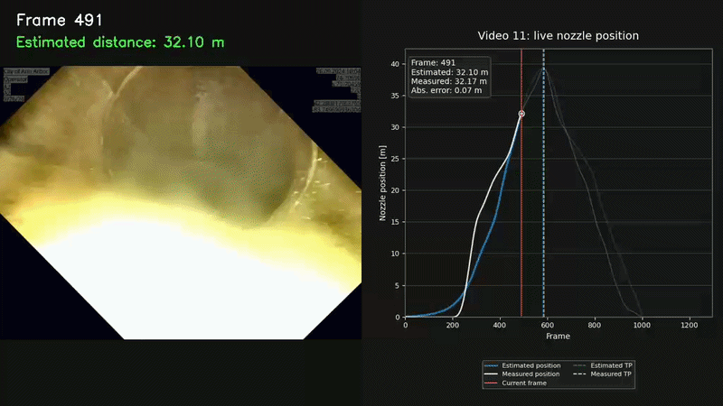

# RFST (RadialFlowSewerTracker)

We (**Carlong Geis, Frederik Kepler, Julius Schneider**) developed RFST during the Helbling x PhysicalAI Hackathon

The "Bomb" travels into the channel, and is pulled back at a certain point, and returns. The solution is evaluated based on the **Mean Absolute Error (MAE)** of the estimated position and the **Frame Error** of the Turning Point (TP). i.e. How many frames off from the real TP the estimated TP was.

**Current Performance:**
* **MAE:** 5.70 m (Average across 8 videos)
* **TP-Error:** 13.5 Frames (Average)

---

## Pipeline Overview

Our odometry estimation goes through a 16-stage pipeline:

1.  **Video Processing:** Load frames sorted numerically.
2.  **Masking:** Extract geometric mask from the first frame because we were scared the keypoints would get confused by the writing and water flowing through the bottom of the pipe.
3.  **Grid Setup:** Pre-calculate radial grids with initial center.
4.  **Flow Calculation:** Determine Optical Flow + radial flow + ring brightness per frame.
5.  **Bounds Detection:** Detect when the robot is inside the pipe (Sewer-Bounds).
6.  **Despiking:** Remove entry and exit spikes (e.g., caused by water entry).
7.  **Outlier Clipping:** Filter outliers via Interquartile Range (IQR).
8.  **Smoothing:** Data smoothing via Kalman RTS Smoother.
9.  **Integration:** Calculate raw position via cumulative sum (`cumsum`) of velocities.
10. **Endpoint Anchoring:** Anchor start and end points to zero (drift correction).
11. **Turning Point:** Determine turning point via `argmax`.
12. **Non-negative Shift:** Shift position values into the positive range.
13. **Scaling:** Separate Alpha-scaling for ascent and descent.
14. **Clipping:** Hard-limit values to the range `[0, channel_length]`.
15. **Direction:** Calculate movement direction (+1, 0, -1).
16. **Padding:** Pad data to original `num_frames` length.

---

## Core Components in Detail

### 1. Optical Flow & Radial Flow
We use `cv2.calcOpticalFlowFarneback` (pyr_scale=0.5, levels=5, winsize=15, iterations=3, poly_n=7, poly_sigma=1.5).
Since the camera moves through a tube, pixels "explode" (forward motion) or "implode" (backward motion) radially. We project the 2D flow onto a radial unit vector. The resulting magnitude is cleaned via IQR filtering (10% - 90% percentile) and distance-weighted (outer pixels count more as they show stronger movement).

### 2. Dynamic FOE Detection (Focus of Expansion)
Since the camera is often not perfectly centered, the vanishing point is not exactly in the center of the image. In the first 1000 frames, we collect strong flow fields and calculate the intersection points of the backward-extrapolated flow lines. The median of these points gives us a robust FOE.
* *Safety Check:* If the calculated FOE deviates more than 25% from the center, it is rejected as faulty.

### 3. Kalman RTS Smoother
The heart of the signal smoothing. A Constant-Velocity Kalman Filter combined with an RTS (Rauch-Tung-Striebel) Backward Smoother.
* **Adaptive R (Measurement Noise):** For weak optical flow, the value for R is set high (filter trusts its motion model). For strong flow, R is set low (filter trusts the measurement).
* The Backward Pass eliminates oscillations (jitters in the video) through mathematically correct inclusion of future frames. This lowered our total MAE from ~7.3 m to ~5.7 m.

### 4. Separate Alpha-Scaling
Since the robot often drives asymmetrically (e.g., slow entry, fast pull-out on the cable), we calculate two separate scaling factors for the ascent and descent based on the real channel length. A safety cap prevents overfitting if the factors deviate too much (factor > 2x) from each other.

### 5. Sewer Bounds Detection & Spike Removal
The start and end points in the water (drop-in/splash) create massive errors. We detect the "In-Channel" phase through a trio of criteria:
* Brightness stability (40-frame window)
* Texture standard deviation within the ring mask
* Flow magnitude below a defined threshold

---

## Discarded Approaches (Lessons Learned)
During the hackathon, we tested the following approaches and discarded them due to performance losses:
* **Water Masking:** The attempt to dynamically mask the water surface was too unreliable and worsened the result.
* **CLAHE Preprocessing:** Histogram Equalization did not provide more robust features for Optical Flow.
* **GT-Calibration (Shape-Warping):** The attempt to learn an average "progress profile" from the ground truth data and align our curves to it failed. The driving profiles of individual videos are too unique (e.g., unexpected stop plateaus).

---

## Obstruction detection (Bonus Work)
We implemented a heuristic approach for obstruction detection and general image classification; results were mapped to individual frames to generate compact infographics (see example below). Additionally, we wrote a script to match video frames to said graphs (see beginning of the README).

* **Odometry Performance:** Compares **Estimated Position** (blue) vs. **Measured Position** (grey), achieving a **6.40m MAE** in this sample [cite: 1].
* **Turning Point:** Successfully detected the reversal point with an error of only **11 frames**.
* **ML Quality Bar:** The bottom track displays our ML model's visibility classification:
    * **Green:** Good visibility.
    * **Orange:** Reduced visibility.
    * **Red:** Poor/no visibility.

---

## Performance Metrics

| Video | MAE [m] | TP-Error [Frames] |
| :---: | :---: | :---: |
| **1** | 6.83 | 23 |
| **2** | 6.46 | 12 |
| **3** | 3.47 | 36 |
| **4** | **1.62** | 6 |
| **8** | 7.59 | 14 |
| **9** | 6.64 | 5 |
| **10** | 10.20 | 8 |
| **11** | 2.75 | **4** |
| **Avg** | **5.70** | **13.5** |

---

## Key Tuning Parameters

| Parameter | Default | Effect |
| :--- | :---: | :--- |
| `Q` *(Kalman process noise)* | `0.0005` | Lower = smoother signal, higher = more responsive |
| `R_base` *(Kalman measurement noise)*| `0.1` | Lower = algorithm trusts optical measurement more |
| `scale` *(Frame downscale)* | `0.5` | Higher = more precise, but significantly slower calculation |
| `winsize` *(Farnebäck)* | `15` | Larger = better suited for fast robot movements |
| `Alpha-Cap-Ratio` | `2.0` | Limits how much ascent and descent can deviate from each other |

---

## Known Limitations
* **Ramp-up Lag:** Farnebäck underestimates displacements in strong acceleration phases (see Video 1, 2, 8, 10). The first 20-30% of the route is systematically slightly underestimated.
